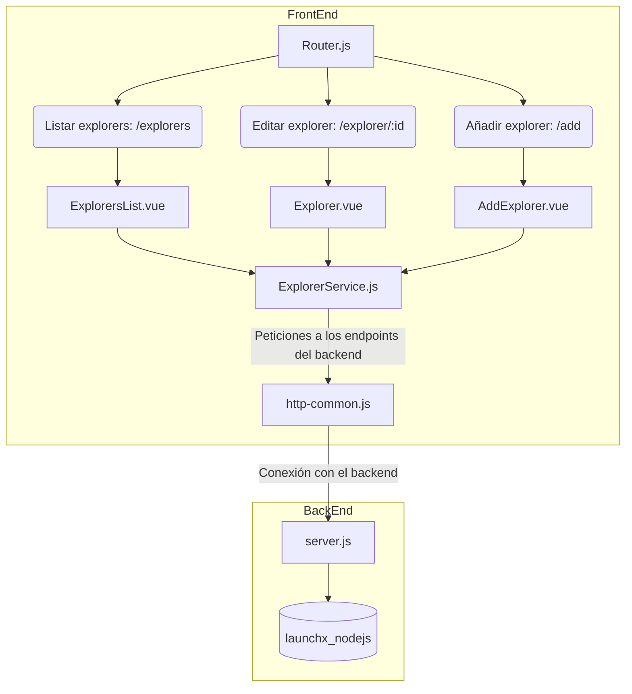
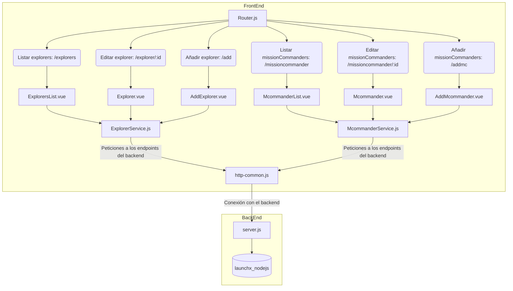

# BackEnd Semana 5 - Proyecto de FullStack: Conexión de Frontend con Backend API

El objetivo de este proyecto es interconectar un servicio Backend que corre una API de consulta en una base de datos PostgreSQL, el cual puede ser consultado en [este repositorio](https://github.com/blu3ming/BackEnd-Semana-5-PrismaDB), con una aplicación Frontend, la cual definiremos en este documento.

# 1. Proyecto original

El proyecto de frontend original es un proyecto muestra del usuario [visualpartnership](https://github.com/visualpartnership), el cual contiene una estructura de componentes escritos en el framework VueJS con el obketivo de conectarse con el backend descrito con anterioridad y poder obtener información acerca de los Explorers inscritos en la base de datos, poder modificar sus datos o incluso eliminarlos del servidor.

Este proyecto, en su estructura original, sigue la siguiente estructura de componentes:



En resumen, emplea tres componentes en su estructura:
- ExplorersList: Componente diseñado para listar todos los explorers de la base de datos y poder obtener información acerca de cada uno de ellos.
- Explorer: Componente que permite editar o eliminar el explorer seleccionado del componente anterior.
- AddExplorer: Componente que nos permite agregar un nuevo explorer, el cual será insertado en la base de datos del lado del backend.

Estos a su vez se conectan por medio de un servicio llamado ExplorerService, el cual hará las consultas a los endpoint de la API en el backend por medio de otro módulo llamado http-common, el cual simplemente contiene la dirección de consulta y protocolos.

# 2. Nuevo requerimiento

A este proyecto legado se nos pide incluir un nuevo requerimiento, el cual consiste en primero crear una nueva tabla del lado del backend en la base de datos para ahora guardar la información relacionada con los MissionCommander.

Esta tabla deberá contener los siguientes campos:

`missionCommander`
| Campo | Tipo |
|---|---|
| id | Integer (autogenerado) |
| name | String |
| username | String |
| mainStack | String |
| currentEnrollment | Boolean |
| hasAzureCertification | Boolean |

Sumado a esto, deberemos completar los siguientes requerimientos para poder trabajar con esta tabla de manera similar a como lo hacemos con los explorers en el proyecto original:

- Crea la tabla nueva anterior. Agrega unos registros por medio de los seeds.
- Crea un CRUD expuesto en un API en el `server.js` (métodos GET, POST, PUT, DELETE, recuerda que el método GET deberá tener 2 endpoints, uno para traer todos los registros y otro para consultar solo el registro por ID).
- En la pantalla inicial del front, consulta todos los registros en esta tabla y muéstralos. Tú decides el diseño.
- Agrega la posibilidad de agregar uno nuevo.
- Agrega la posibilidad de editar el `mainStack`.
- Agrega la posibilidad de eliminar el registro.

Con base en esta información, se concluye que el proyecto deberá trabajar en conjunto con el original y solo incluir las nuevas funcionalidades solicitadas, de tal manera que la estructura de proyecto quedaría ahora de la siguiente manera:



Es decir, prácticamente deberemos realizar funcionalidades espejo del proyecto original, pero ahora trabajando única y exclusivamente sobre la información relacionada a los Mission Commander que se encuentre en la base de datos del backend; por esta misma razón, requerimos de un Service independiente del original, ya que este trabajará sobre los endpoints nuevos para el tipo de dato solicitado.

# 3. Desarrollo (Backend)

Para comenzar, se crea la nueva tabla con ayuda de Prisma en el lado del backend. El desarrollo y explicación de este apartado puede encontrarse en el [README](https://github.com/blu3ming/BackEnd-Semana-5-PrismaDB/blob/master/README.md) de dicho repositorio. En resumen, creamos una nueva tabla con los datos solicitados:

```javascript
model MissionCommander {
  id Int @id @default(autoincrement())
  name String @unique
  username String @db.VarChar(255)
  mainStack String @db.VarChar(255)
  currentEnrollment Boolean @default(false)
  hasAzureCertification Boolean @default(false)
}
```

Una vezrealizado el migrate de esta nueva tabla para actualizarla en la DB, creamos un par de datos en el archivo seed.js:

```javascript
const commander1 = await prisma.missionCommander.upsert({
            where: { name: "Mission Commander 1" },
            update: {},
            create: {
                name: "Mission Commander 1",
                username: "mcGio",
                mainStack: "Node",
                currentEnrollment: true,
                hasAzureCertification: true
            },
        });
```

Verificamos en la base de datos que las nuevas entradas se hayan introducido correctamente:


Por último, solo creamos los endpoints correspondientes en el servidor API del backend:

| Endpoint | Request | Metodo | Response |
|---|---|---|---|
| `/missioncommander` | `localhost:3000/missioncommander` | GET |Se deberá obtener la información de todos los MissionCommander con todos sus campos |
| `/missioncommander/:id` | `localhost:3000/missioncommander/:id` | GET | Se deberá obtener toda la información del MissionCommander cuyo id se especifique |
| `/missioncommander` | `localhost:3000/missioncommander` | POST |Se agregará un nuevo MissionCommander con la data recibida en el body del request (name, username y mainStack) |
| `/missioncommander/:id` | `localhost:3000/missioncommander/:id` | PUT | Se editará únicamente el campo mainStack del MissionCommander cuyo id se especifique (recibido por el body del request) |
| `/missioncommander/:id` | `localhost:3000/missioncommander/:id` | DELETE | Se eliminará al MissionCommander cuyo id se especifique de la base de datos |

Se creó además un paquete de peticiones para Postman para poder probar estos endpoints y su funcionamiento: [CommandersCRUD.zip](https://github.com/blu3ming/client-launchx/files/8653951/CommandersCRUD.zip)

# 4. Desarrollo (Frontend)

Ya con el servidor configurado para recibir las peticiones especificadas por los requerimientos, procedemos a crear los componentes descritos en la estructura de proyecto propuesta. Para ello, se sigue una misma metodología para los tres que se requieren:

- Agregar la nueva ruta (URL) en el archivo router.js correspondiente al componente en desarrollo.
- Añadir dicha ruta en la navbar del archivo App.vue.
- Agregar la funcionalidad necesaria en el archivo Service (en este caso, CommanderService.js).
- Crear el componente que realizará la funcionalidad requerida (.vue) y conectarlo con el Service del punto anterior.
- Comprobar funcionamiento.

A fin de describir de manera más didáctica ese proceso, solo se detallará el primero de ellos, entendiendo que los otros dos se desarrollan siguiendo la misma metodología.

# 5. Componente para listar Mission Commanders (McommanderList.vue).

Siguiendo la metodología, el primer paso consiste en agregar la nueva ruta en el archivo router.js del proyecto para que VueJS sepa a dónde debe dirigirse cuando este componente sea llamado:

```javascript
{
    path: "/missioncommanders",
    name: "missioncommanders",
    component: () => import("./components/McommanderList")
},
```

Ya con la ruta especificada, se debe añadir dicha entrada en la barra de navegación del archivo principal del proyecto, de tal manera que esta sea visuble en cualquier ruta dentro de este. Para ello, nos vamos al archivo App.vue e introducimos la siguiente entrada dentro de la clase `navbar-nav mr-auto`:

`<router-link to="/missioncommanders" class="nav-link">Mission Commanders</router-link>`

Siendo el primer componente, deberemos crear primero el archivo Service que nos permitirá conectarnos con el API del backend. Para ello, podemos copiar el formato del Service original que contemplaba únicamente a los explorers e introducir los nuevos endpoints, en este caso, únicamente del listado de MissionCommanders. Recordemos que para este componente requerimos tanto listarlos a todos, como los datos de uno solo que sea seleccionado.

```javascript
import http from "../http-common";

class CommanderService {
  getAll() {
    return http.get("/missioncommander");
  }
  get(id) {
    return http.get(`/missioncommander/${id}`);
  }
}

export default new CommanderService();
```

Ya con esta configuración establecida, podemos crear el componente en el directorio correspondiente, en este caso, se le da el nombre de `McommanderList.vue`. Este componente replica el mismo comportamiento del original `ExplorersList.vue`, por lo que la estructura de archivo se mantiene, modificando las funciones correspondientes desccritas en el CommanderService.js y verificando que los nombres de variables coincidan con el nuevo requerimiento también. El archivo puede revisarse en la [esta ruta](https://github.com/blu3ming/client-launchx/blob/master/src/components/McommanderList.vue).

Nota: Al desarrollar estas nuevas funcionalidades, se agregó además que cada página tuviera un título dinámico en el sitio web al momento de visualizarlo en el navegador, es decir, el nombre que aparece en la pestaña de este. Para ello, se añadió la función **mounted** a aquellos componentes que no lo tuvieran junto con la función document.title:

```javascript
mounted() {
    document.title = "Título del sitio";
}
```

Con esto finalizado, podemos entonces comprobar la funcionalidad de este nuevo requerimiento:


Vemos cómo la página web despliega un listado de todos los MissionCommanders que se encuentran en la base de datos, y al seleccionar a uno de ellos, el mismo sitio nos devuelve los datos de dicho Commander.

# 6. Componente para agregar Mission Commanders (AddMcommander.vue).

El proceso y la metodología para añadir este nuevo componente es el mismo de antes, por lo que no nos detendremos a analizar paso por paso, solo se mostrarán. Para iniciar, agregamos la nueva ruta al router.js:

```javascript
{
    path: "/add-mc",
    name: "add-missioncommander",
    component: () => import("./components/AddMcommander")
},
```

Añadimos dicha entrada en la barra de navegación del archivo principal del proyecto App.vue:

`<router-link to="/add-mc" class="nav-link">Agregar M. Commander</router-link>`

Ahora añadimos la función que se conectará al endpoint correspondiente del backend.

```javascript
create(data) {
    return http.post("/missioncommander", data);
  }
```

Creamos el componente AddMcommander.vue a semejanza del original para los Explorers, modificando funciones y variables correspondientes. Por último, comprobamos su funcionalidad:


# 7. Componente para editar y eliminar Mission Commanders (Mcommander.vue).

Este último componente es el que nos permtirá tanto editar el mainStack del Commander como eliminarlo de la base de datos. Para ello, solo es necesario añadir una ruta en el router.js:

```javascript
{
    path: "/missioncommander/:id",
    name: "mcommander-details",
    component: () => import("./components/Mcommander")
}
```

Esta entrada es llamada desde el McommanderList, por lo que no requiere se añadida al navbar de App.vue. A diferencia del componente anterior, ahora debemos añadir las dos funciones que se conectarán al endpoint correspondiente del backend para realizar estas operaciones:

```javascript
update(id, data) {
    return http.put(`/missioncommander/${id}`, data);
}
delete(id) {
    return http.delete(`/missioncommander/${id}`);
}
```

Creamos el componente Mcommander.vue a semejanza del original para los Explorers, modificando funciones y variables correspondientes. Por último, comprobamos su funcionalidad:

Prueba para editar el MainStack de un Commander:


Prueba para eliminar un Commander:


